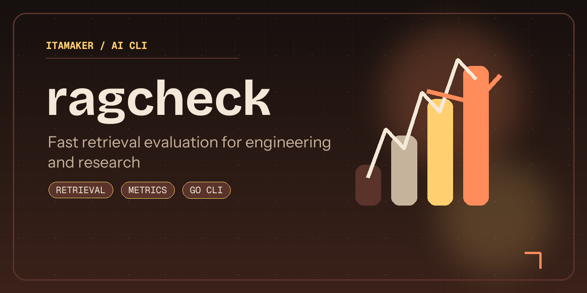

# ragcheck

[](#contributors-)

`ragcheck` is a Go CLI for evaluating retrieval and RAG runs offline.

It gives you fast `Precision@k`, `Recall@k`, `HitRate@k`, `MRR@k`, `MAP@k`, `nDCG@k`, and lightweight answer/context judges without spinning up notebooks or Python-based eval tooling.



## Support

[](https://buymeacoffee.com/amaker)

## Quickstart

### Install

```bash
brew install itamaker/tap/ragcheck
```

<details>
<summary>You can also download binaries from <a href="https://github.com/itamaker/ragcheck/releases">GitHub Releases</a>.</summary>

Current release archives:

- macOS (Apple Silicon/arm64): `ragcheck_0.2.0_darwin_arm64.tar.gz`
- macOS (Intel/x86_64): `ragcheck_0.2.0_darwin_amd64.tar.gz`
- Linux (arm64): `ragcheck_0.2.0_linux_arm64.tar.gz`
- Linux (x86_64): `ragcheck_0.2.0_linux_amd64.tar.gz`

Each archive contains a single executable: `ragcheck`.

</details>

### First Run

Run:

```bash
ragcheck
```

This launches the interactive Bubble Tea terminal UI.

You can still use the direct command form:

```bash
ragcheck score -qrels examples/qrels.json -run examples/run.json -k 3
```

Judge answer quality and grounding:

```bash
ragcheck judge -input examples/judge.json
```

## Requirements

- Go `1.22+`

## Run

```bash
go run . score -qrels examples/qrels.json -run examples/run.json -k 3
```

Supported metrics:

- `Precision@k`
- `Recall@k`
- `HitRate@k`
- `MRR@k`
- `MAP@k`
- `nDCG@k`

## Build From Source

```bash
make build
```

```bash
go build -o dist/ragcheck .
```

## What It Does

1. Loads qrels and retrieval run files from JSON.
2. Matches retrieved document IDs against relevant sets.
3. Computes standard and graded top-k retrieval metrics.
4. Can judge answer relevance, context relevance, groundedness, and reference coverage for RAG outputs.
5. Prints quick offline evaluation summaries for engineering and research loops.

## Notes

- Keep qrels and run files aligned on `query_id`.
- Maintainer release steps live in `PUBLISHING.md`.

## Contributors ✨

| [![Zhaoyang Jia][avatar-zhaoyang]][author-zhaoyang] |
| --- |
| [Zhaoyang Jia][author-zhaoyang] |


[author-zhaoyang]: https://github.com/itamaker
[avatar-zhaoyang]: https://images.weserv.nl/?url=https://github.com/itamaker.png&h=120&w=120&fit=cover&mask=circle&maxage=7d

## License

[MIT](LICENSE)
